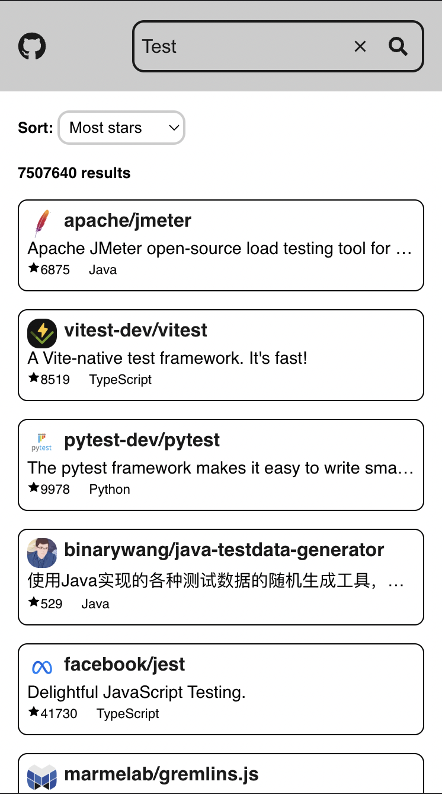
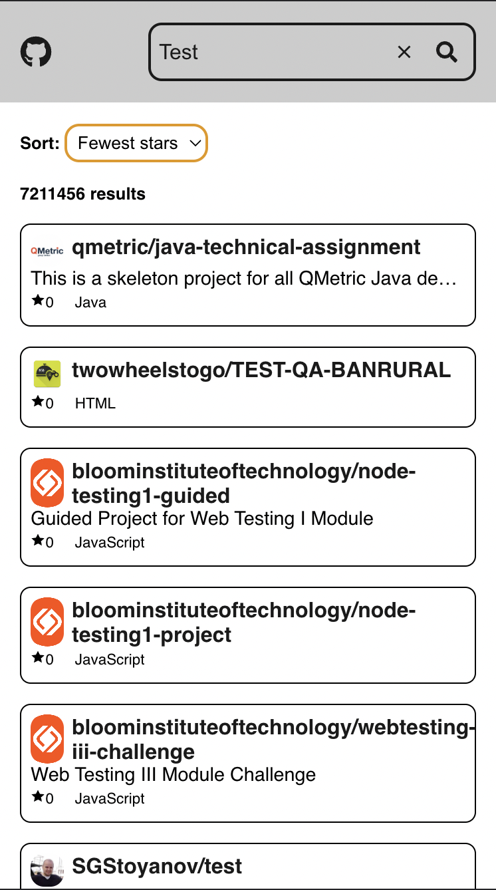

# RN-Dice
Repo for assessment task from DICE

## Setup
To run this project, install it locally using npm:

```
$ npm install
$ npm start
```

## Design

A simple design with a Landing page & Search result with sorting by Stars.


## Sort by error

The sort parameter in Github search Repo only takes stars & forks. Hence it could not be sorted by waters_count, name, created_at & updated_at.

Source: https://stackoverflow.com/questions/40762518/github-api-sorting-search-results-by-the-created-at-field

https://docs.github.com/en/rest/search?apiVersion=2022-11-28#search-repositories


## Screenshots



